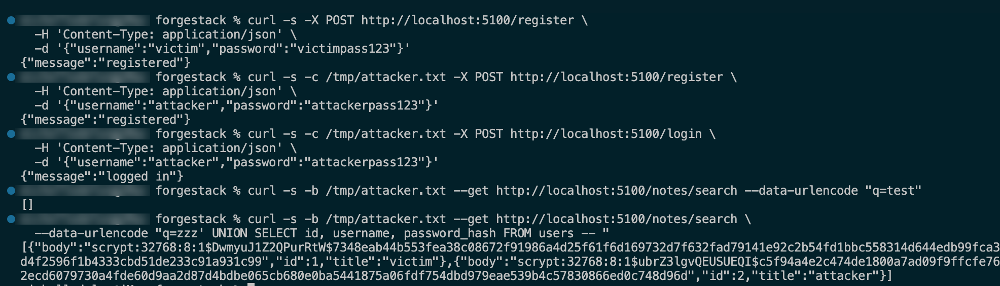
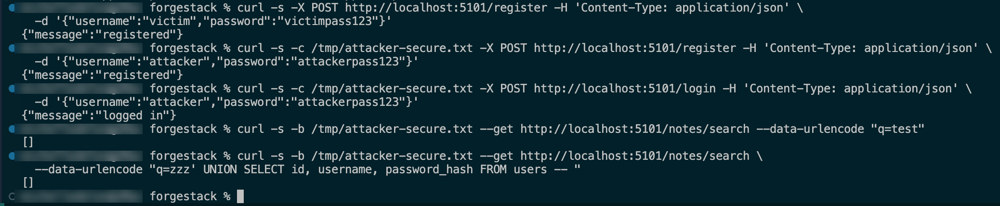

# ForgeStack — DevSecOps Playground

> **TL;DR:** Same app, two assembly lines. One ships bugs to production. The other catches them before they leave the factory. This repo proves it with a real exploit — same attack, run against both, different outcomes.


Full write-up: [`docs/attack-demo.md`](docs/attack-demo.md). Want to run it yourself? `make demo` — see [`WALKTHROUGH.md`](WALKTHROUGH.md).

---

## ELI5

Imagine two toy-car factories building the exact same car.

- **Factory A** slaps the car together and ships it straight out the door. No inspection.
- **Factory B** runs every car through a checklist first — checking the brakes, checking the wiring, checking nothing's loose — before it's allowed to leave.

Both factories *look* like they're doing the same job. The only way to know Factory B is actually better is to watch what happens when a car has something wrong with it.

That's what this repo does, except instead of toy cars, it's a small web app — and instead of "something wrong," it's four real, intentionally-planted security bugs:

1. **A SQL injection hole** — think of it like a form on a website that, instead of just accepting your name, will also accept sneaky commands and hand over the whole database if you type the right trick.
2. **A hardcoded secret** — like taping your house key to the front door where anyone can find it, instead of keeping it somewhere safe.
3. **An outdated ingredient with a known recall** — a dependency version with a publicly documented bug, kept in use even though a fixed version already exists.
4. **A wide-open front door** — the container runs as an all-powerful root user, and its base image isn't locked to a specific, reviewed version, so what actually ships can silently change underneath you.

There are **two versions of the same app**:
- `vulnerable-app` — has all four bugs, on purpose.
- `secure-app` — same features, all four fixed properly.

And **two pipelines** (the automated "factory line" that builds and deploys the code):
- **Insecure pipeline** — build → deploy. No checks. Anything goes.
- **Secure pipeline** — build → five parallel scans → sign → verify → *then* deploy. If something's wrong, it stops before it ever reaches production.

The secure pipeline uses five tools as its inspectors, plus a final gate:
| Tool | What it checks, in plain terms |
|---|---|
| [**Semgrep**](https://semgrep.dev/) | Reads the actual code for known-bad patterns (like the SQLi hole) |
| [**CodeQL**](https://codeql.github.com/) | GitHub's own deep code scanner, another set of eyes on the source |
| [**Gitleaks**](https://github.com/gitleaks/gitleaks) | Scans for secrets accidentally committed to source (like the hardcoded key) |
| [**Trivy**](https://trivy.dev/) | Checks the app's ingredients (dependencies) and the container for known vulnerabilities |
| [**Cosign**](https://docs.sigstore.dev/cosign/) | Digitally signs the finished container, like a tamper-evident seal, so you know what shipped is what was checked |

Signing isn't the last word, though — a separate **gate** step then *verifies* that signature before deploy is allowed to run at all. That's the difference between "the scans were configured to run" and "the scans provably ran and passed": the gate won't accept a signature that doesn't check out, and deploy can't get the image any other way.

**The proof:** run the same attack against both. The insecure pipeline lets it through. The secure pipeline blocks the deploy. Side by side, that's the whole story — not "trust me, security tooling helps," but "watch it happen."

---

## Status

**Both phases are complete — everything below is real and running today, not aspirational.**

- `insecure-pipeline` and `secure-pipeline` are both live; `secure-pipeline` runs all five scans, signs, and verifies on every PR. All 10 checks are required status checks on `main` — a PR with a failing scan is genuinely blocked, not just flagged.
- The attack is scripted ([`security/exploits/sqli_exploit.py`](security/exploits/sqli_exploit.py)) and run for real against both apps — see the GIF above and [`docs/attack-demo.md`](docs/attack-demo.md).
- It also reproduces by hand, not just via the script — a raw `curl` session against `vulnerable-app` walking through register → login → a normal search → the same UNION-based payload leaking another user's password hash:

  

  The identical sequence, identical payload, against `secure-app` instead — both injection attempts come back empty:

  

- The gate is verified to actually block a reintroduced vulnerability (proof: [PR #5](https://github.com/Pinkish-Warrior/forgestack/pull/5), closed unmerged, real red X).
- Every PR gets an auto-generated findings report ([sample](reports/sample-findings.md)).
- [`docs/architecture.md`](docs/architecture.md) has the full pipeline diagram and the proof behind it.

## Why this exists

This is a portfolio project built to demonstrate hands-on DevSecOps skills — not just knowing the tool names, but wiring them into a real CI/CD gate that actually fails a build when it should.

## Structure

```
forgestack/
├── WALKTHROUGH.md                # clone-to-running guide, incl. `make demo`
├── Makefile                      # `make demo` — one-command build/run/exploit/teardown
├── applications/
│   ├── vulnerable-app/          # the bug-ridden version
│   └── secure-app/              # the hardened version
├── pipelines/                   # human-readable pipeline docs
├── .github/workflows/           # the actual runnable GitHub Actions
├── security/
│   ├── semgrep/, trivy/, codeql/, cosign/   # scanner + signing config
│   ├── exploits/sqli_exploit.py             # the real attack, scripted
│   └── reports/generate_findings_report.py  # SARIF → Markdown report generator
├── reports/
│   ├── sample-findings.md        # sample scan findings report
│   └── screenshots/              # evidence: manual exploit repro, etc.
└── docs/
    ├── references.md            # background reading (SAST/DAST, tool docs)
    ├── architecture.md          # pipeline diagram + narrative
    ├── attack-demo.md           # exact exploit steps + reproduction
    └── attack-demo.gif          # recorded proof: same attack, both apps
```

## ⚠️ Disclaimer

`vulnerable-app` is intentionally broken for educational/demo purposes. **Do not deploy it publicly or reuse it in production.**

## References

Tool-by-tool breakdown of what each one catches is in the [ELI5](#eli5) table above. For background on SAST vs. DAST and further reading, see [`docs/references.md`](docs/references.md).
