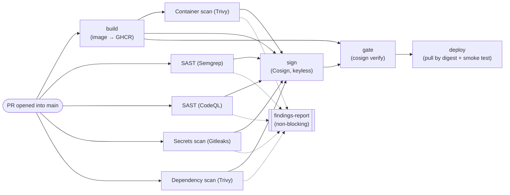

# Architecture

Same app, two pipelines. One builds and ships without looking; the other
looks first and can refuse to ship. This is what "looks first" actually
does, job by job, as it runs on every PR into `main`.

Five scans run the moment a PR opens — four against source in parallel
with the build, one (container scan) once the image exists. All five feed
two places: `sign`, which only signs an image that cleared every scan, and
`findings-report`, a non-blocking job that merges their output into one
readable Markdown summary for the PR (findings-report doesn't gate — the
scans themselves are the gate). `gate` then re-verifies that signature
before `deploy` is allowed to pull the image at all — so a passing `deploy`
is proof a real signature checked out, not just that the earlier jobs were
configured to run.

**The insecure pipeline, for contrast, is the same two edges with
everything in between deleted:** `push → build → deploy`. No scans, no
signature, no gate — [`pipelines/insecure-pipeline/README.md`](../pipelines/insecure-pipeline/README.md)
has the details. It's not a strawman; it's the default shape of a lot of
real CI.

## The gate is structural, not a suggestion

All nine jobs above, plus GitHub's own native `CodeQL` code-scanning
check (a side effect of the `codeql` job's SARIF upload — GitHub posts
this as a separate status check from the job itself, named plainly
`CodeQL` rather than `SAST (CodeQL)`), are **required status checks** on
`main`, with `strict: true` and `enforce_admins: true` and no bypass. A PR
with a failing scan can't be merged — not flagged, not warned, actually
blocked. That's the difference this whole project is built to
demonstrate: a check that runs is a report; a check that's required is a
gate.

## Proof, not just design

The gate has been verified to actually block something, not just assumed
to work: [PR #5](https://github.com/Pinkish-Warrior/forgestack/pull/5)
reintroduced a real SQL injection into `secure-app` on a throwaway branch
and opened it against `main`. It came back `BLOCKED` via the GitHub API —
closed unmerged once confirmed, but the PR itself (and its failing checks)
is still visible in the repo's history. That same test surfaced a real
gap — Semgrep's SQLi rule matched an exact AST shape that missed both
apps' actual f-string-concatenation style, so it silently found nothing
against a real, unambiguous injection. Fixed by rewriting it in taint
mode (`security/semgrep/semgrep-rules.yaml`), verified against the real
files, not synthetic test snippets. The exploit itself — the same
payload, run against both apps, one leaking data and one not — is
recorded in [`docs/attack-demo.md`](attack-demo.md).

## Where to go deeper

- [`pipelines/secure-pipeline/README.md`](../pipelines/secure-pipeline/README.md) — job-by-job detail, plus *"where the gate lives"* (PR-time vs. post-deploy scanning, and why that distinction is the whole point)
- [`pipelines/insecure-pipeline/README.md`](../pipelines/insecure-pipeline/README.md) — the control this is measured against
- [`docs/attack-demo.md`](attack-demo.md) — the exploit, the GIF, and how to reproduce both
- [`reports/sample-findings.md`](../reports/sample-findings.md) — a real generated findings report, for what `findings-report` actually produces
- [`docs/references.md`](references.md) — background reading on SAST vs. DAST and the individual tools
